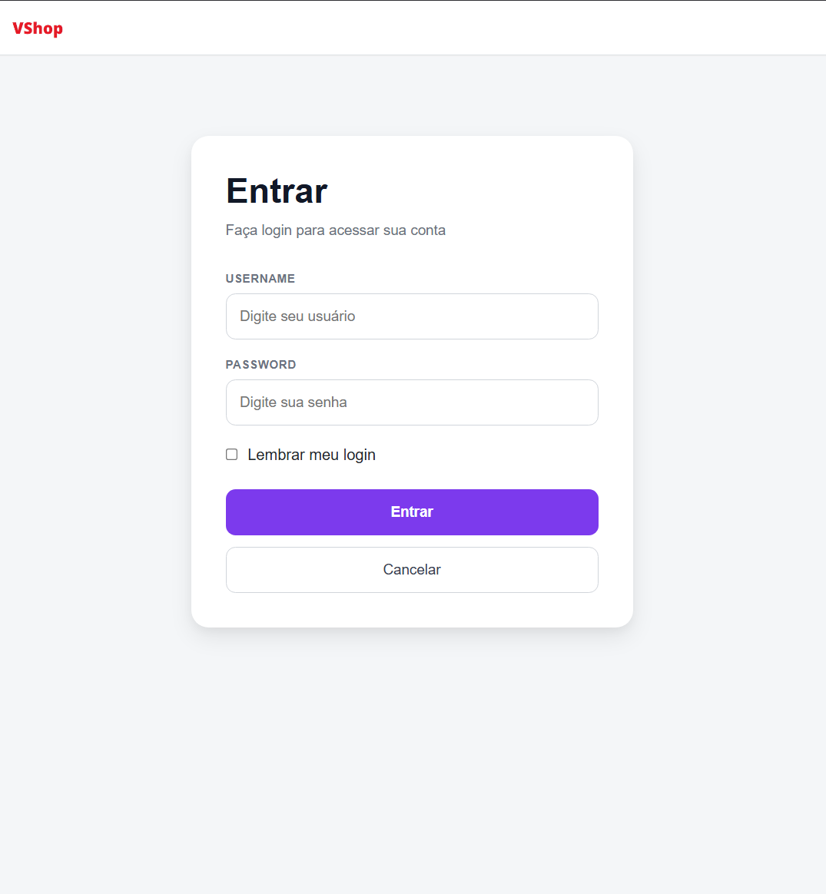
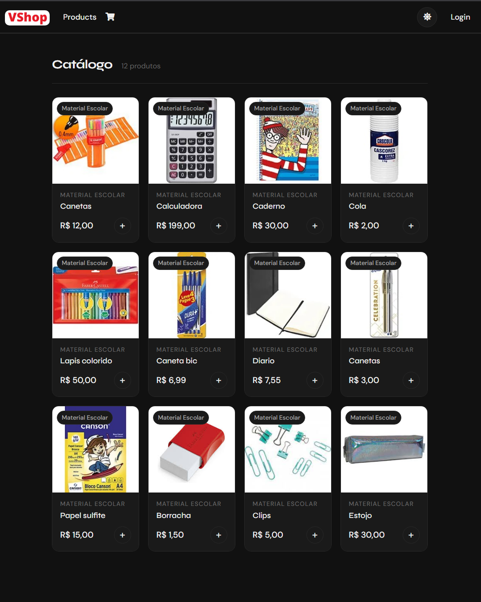
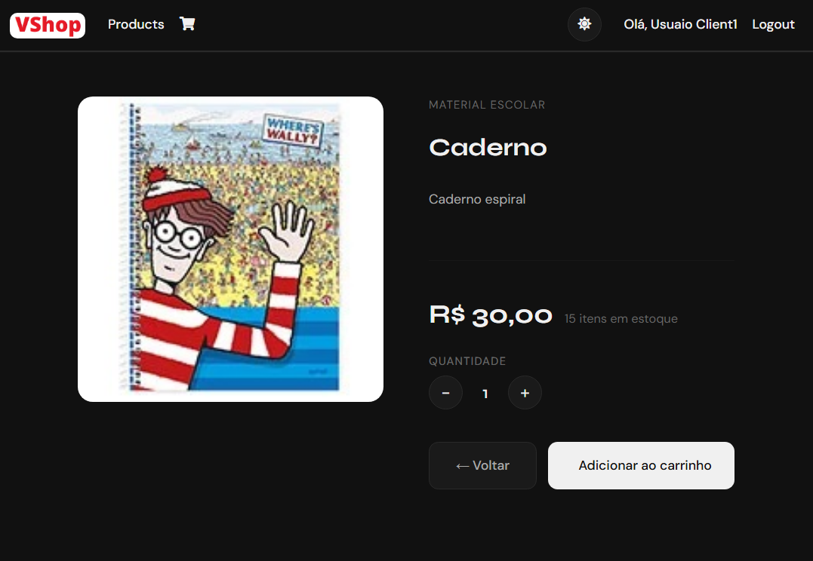
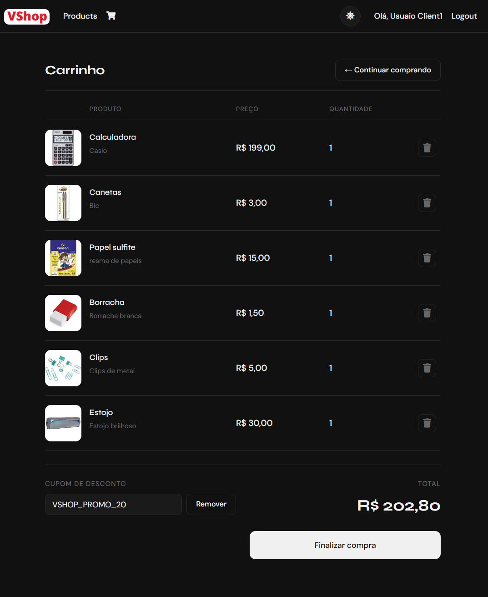
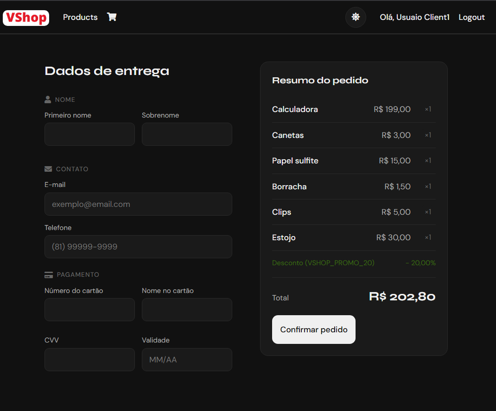
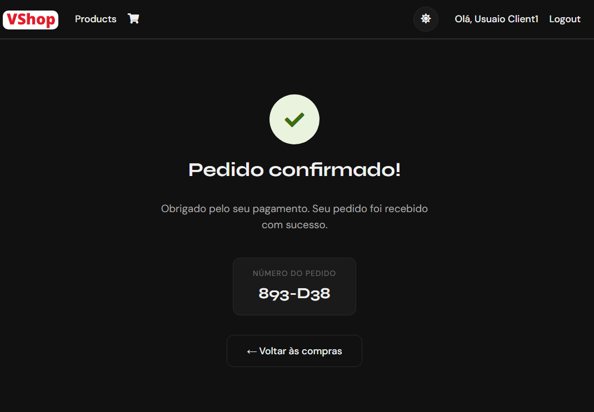
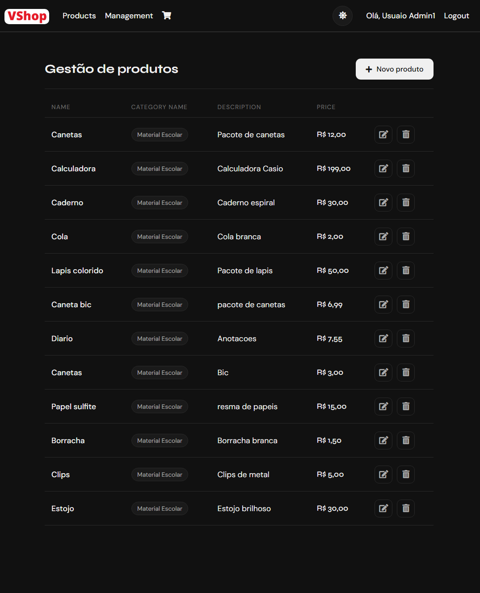
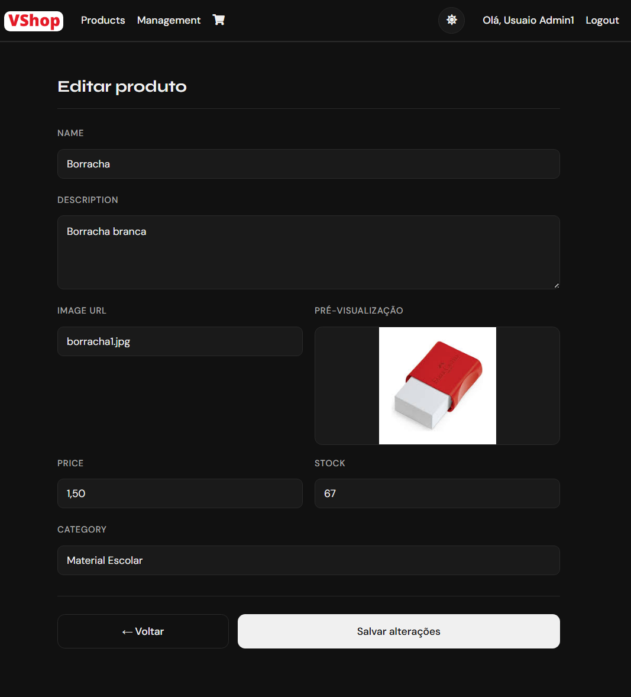
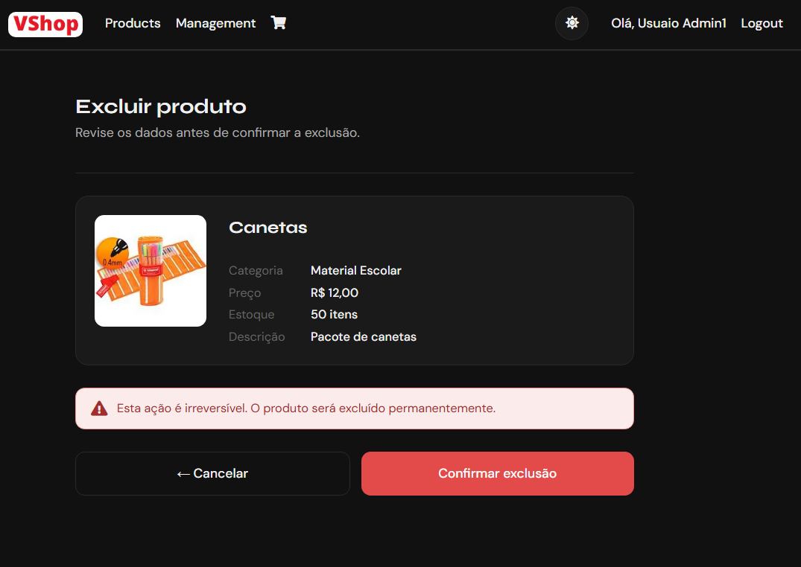

# 🛒 VShop — Plataforma de E-Commerce com Microsserviços

VShop é uma aplicação de e-commerce construída com arquitetura de **microsserviços**, desenvolvida com foco em boas práticas de desenvolvimento, separação de responsabilidades e escalabilidade. O projeto abrange desde a autenticação centralizada até a gestão de produtos, carrinho e descontos.

---

## 📐 Arquitetura

O projeto é dividido em serviços independentes que se comunicam entre si, com um front-end MVC consumindo as APIs:

```
VShop/
├── VShop.Web               # Front-end MVC (ASP.NET Core)
├── VShop.ProductApi        # Microsserviço de Produtos
├── VShop.CartApi           # Microsserviço de Carrinho
├── VShop.DiscountApi       # Microsserviço de Descontos
└── VShop.IdentityServer    # Servidor de Identidade e Autenticação (JWT)
```

---

## 🚀 Tecnologias e Práticas Utilizadas

### Back-end
| Tecnologia | Descrição |
|---|---|
| **ASP.NET Core Web API** | Criação dos microsserviços RESTful |
| **Entity Framework Core** | ORM para acesso e mapeamento ao banco de dados |
| **AutoMapper** | Mapeamento automático entre entidades e DTOs |
| **DTOs (Data Transfer Objects)** | Separação entre modelos de domínio e dados trafegados |
| **IdentityServer** | Servidor de autenticação centralizado (OpenID Connect / OAuth 2.0) |
| **JWT (JSON Web Token)** | Autenticação stateless entre serviços e cliente |

### Front-end
| Tecnologia | Descrição |
|---|---|
| **ASP.NET Core MVC** | Interface web para consumo dos microsserviços |
| **Razor Views** | Templates de UI integrados ao ASP.NET Core |

### Padrões e Boas Práticas
- ✅ Arquitetura de **Microsserviços**
- ✅ Padrão **Repository**
- ✅ **DTOs** para desacoplamento de camadas
- ✅ **Injeção de Dependência** nativa do ASP.NET Core
- ✅ Autenticação e autorização com **Identity + JWT**
- ✅ Separação de responsabilidades por serviço

---

## 🧩 Microsserviços

### 🛍️ VShop.ProductApi
Responsável pelo cadastro e consulta de produtos.

- CRUD completo de produtos
- Integração com EF Core e banco de dados relacional
- Mapeamento com AutoMapper entre `Product` e `ProductDTO`

### 🛒 VShop.CartApi
Gerencia o carrinho de compras dos usuários.

- Adição, remoção e consulta de itens no carrinho
- Integração com o serviço de Descontos para aplicação de cupons
- Comunicação via HTTP com os demais serviços

### 🏷️ VShop.DiscountApi
Gerencia cupons e descontos aplicáveis ao carrinho.

- CRUD de cupons
- Validação e aplicação de descontos

### 🔐 VShop.IdentityServer
Servidor centralizado de autenticação e autorização baseado em **IdentityServer4/Duende**.

- Emissão de tokens JWT
- Autenticação com OpenID Connect
- Controle de acesso por escopo e roles

### 🌐 VShop.Web
Aplicação front-end em **ASP.NET Core MVC** que consome os microsserviços.

- Autenticação delegada ao IdentityServer
- Exibição de produtos, gerenciamento de carrinho e aplicação de cupons
- Comunicação HTTP com as APIs internas

---

## ⚙️ Como Executar

### Pré-requisitos

- [.NET 8 SDK](https://dotnet.microsoft.com/download)
- SQL Server (ou outro banco configurado no `appsettings.json`)
- Visual Studio 2022 ou VS Code

### Passos

1. **Clone o repositório:**
```bash
git clone https://github.com/mjpa10/VShop.git
cd VShop
```

2. **Configure o banco de dados** em cada `appsettings.json` dos projetos de API:
```json
"ConnectionStrings": {
  "DefaultConnection": "Server=.;Database=VShopDb;Trusted_Connection=True;"
}
```

3. **Execute as migrations** em cada projeto de API:
```bash
dotnet ef database update
```

4. **Inicie os projetos** (em terminais separados ou via Visual Studio com múltiplos projetos de inicialização):
```bash
# IdentityServer (deve ser iniciado primeiro)
cd VShop.IdentityServer && dotnet run

# APIs
cd VShop.ProductApi && dotnet run
cd VShop.CartApi && dotnet run
cd VShop.DiscountApi && dotnet run

# Front-end
cd VShop.Web && dotnet run
```

> 💡 **Dica:** No Visual Studio, configure a solução para iniciar múltiplos projetos simultaneamente em `Propriedades da Solução > Projeto de Inicialização`.

---

## 🗄️ Banco de Dados

Cada microsserviço possui seu **próprio contexto de banco de dados**, seguindo o princípio de isolamento de dados da arquitetura de microsserviços.

| Serviço | Contexto |
|---|---|
| ProductApi | `AppDbContext` |
| CartApi | `AppDbContext` |
| DiscountApi | `AppDbContext` |
| IdentityServer | `ApplicationDbContext` |

---

## 🔒 Autenticação e Autorização

O fluxo de autenticação segue o padrão **OAuth 2.0 / OpenID Connect**:

```
Usuário → VShop.Web → IdentityServer (login + token JWT)
VShop.Web → ProductApi / CartApi / DiscountApi (Authorization: Bearer <token>)
```

Todos os endpoints protegidos validam o token JWT emitido pelo `VShop.IdentityServer`.

---

## 📸 Screenshots

### 🔐 Login


---

### 🏠 Catálogo de Produtos


---

### 🔍 Detalhes do Produto


---

### 🛒 Carrinho com Cupom de Desconto


---

### 💳 Checkout


---

### ✅ Pedido Confirmado


---

### ⚙️ Gestão de Produtos (Admin)


---

### ✏️ Editar Produto (Admin)


---

### 🗑️ Excluir Produto (Admin)


---

## 👤 Autor

Desenvolvido por **mjpa10**

